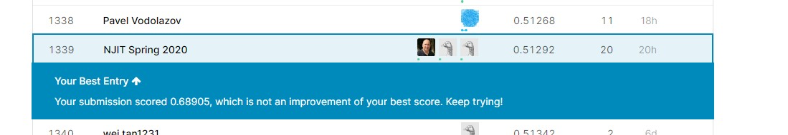
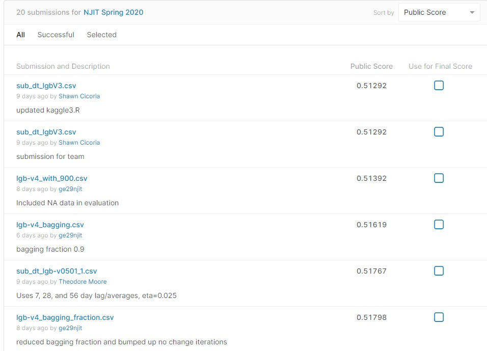
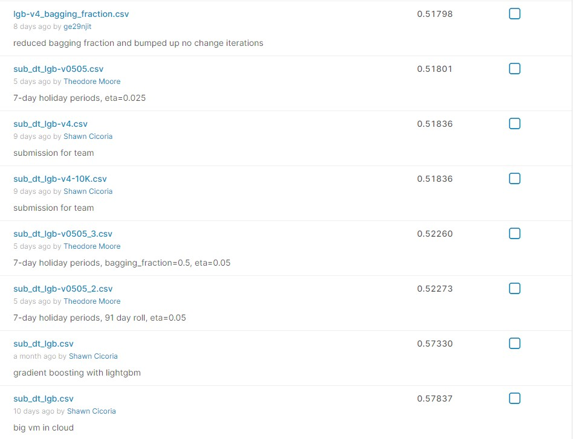
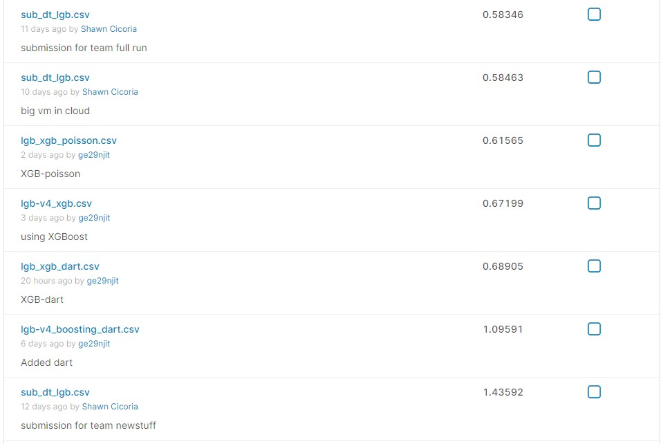

# Kaggle project assignment


> You will work on the below Kaggle challenge: https://www.kaggle.com/c/m5-forecasting-accuracy


1.	Form a team with no more than four students (including yourself)
2.	Submit your result to Kaggle website
3.	Submit a text file to Canvas including:
    - Your team members and each one’s contribution; 
    - Briefly explain your pipeline and methods; 
    - The training performance
    - The final testing performance and ranking in Public Leaderboard
4.	Your score for this project will depend on your ranking in the Kaggle Public Leaderboard
5.	Deadline for this project is May 14th, 2020


# Project Report - Team [Godzilla](https://devblogs.microsoft.com/azuregov/3135/)

## Team members

| Member               | email           | Contribution |
|----------------------|-----------------|--------------|
| Gene Eagle           | ge29@njit.edu   |              |
| Theodore (Ted) Moore | tm437@njit.edu  |              |
| Shawn Cicoria        | sc2443@njit.edu |              |


## Pipeline and Methods

### Dataset size issues
The team at first realized the size of the data was going to be an issue. We first examined the data and basid exploratory data analysis and realized the extend and size of the data would most likely be an issue.

First atttempts at running on local machines basic models caused errors with memory consumption.

At first we utilize sampling of the data to limit the the number of training samples for training the model, but that achieve horrible performance.  For example, the following used conditional sampling for our "read data" function that was used both in training and prediction.

```
create_dt <- function(is_train = TRUE, nrows = Inf, sample_size = 1000) {
  prices <- fread("./data/sell_prices.csv")
  cal <- fread("./data/calendar.csv")
  cal[, `:=`(date = as.IDate(date, format="%Y-%m-%d"),
             is_weekend = as.integer(weekday %chin% c("Saturday", "Sunday")))]

  if (is_train) {
    dt <- fread("./data/sales_train_validation.csv", nrows = nrows)
    dt <- dt[sample(nrow(dt), sample_size), ]
  } else {
    dt <- fread("./data/sales_train_validation.csv", nrows = nrows,
                drop = paste0("d_", 1:(tr_last-max_lags)))
    dt[, paste0("d_", (tr_last+1):(tr_last+2*h)) := NA_real_]
  }
```

Reviewing other examples in Kaggle we ended up taking advantage of the [`data.table`](https://rdatatable.gitlab.io/data.table/) package that provides both fast read capabilities and is memory efficient.  In addition it introduced some operators for the data that helped in providing concise fluent API for quering the data - a "chain like" approach similar to `%>% for other R packages.

The following vignette and artile are good overviews:
- https://cran.r-project.org/web/packages/data.table/vignettes/datatable-intro.html
- https://www.machinelearningplus.com/data-manipulation/datatable-in-r-complete-guide/

From the examples the syntax allows complex conditional clauses, SQL like within the statements to make the interaction with the dataset more concise and clearer.


### Dataset time series and prediction shapes


### Review of existing models and choice

The initial set of scripts in R were taken from an existing R notebook for Sales Data. This notebook made use of [LightGBM](https://lightgbm.readthedocs.io/en/latest/) simlar to XGboots


### LightGBM
```
LightGBM is a gradient boosting framework that uses tree based learning algorithms. It is designed to be distributed and efficient with the following advantages:
```


## Aquiring a VERY large VM

At first, memory consumption was an issue. Laptops with 16 Gig or less were not able to handle the entire dataset. Sampling helped, but performance with sampled data wasn't worth it.

Second boundary was CPU. Fortunately, the team has access to Microsoft Azure compute capabilities in for very large Virtual Machines. At one point the team was utilizing a Virtual Machine with 64 cores and 256 Gig of ram. Ultimately, the choice of the underlying package [LightGBM](### LightGBM) the ability to parallel process on many cores permitted a bit better run times.

However, run times were **EXTREMELY LONG** - in some cases 24 hours, and often easily 4 or more hours.


## Training performance


## Final Testing performance and Public Leadearboard Ranking

The final position in the Kaggle competition at time of this report:

 


### Public Submission Ranking









