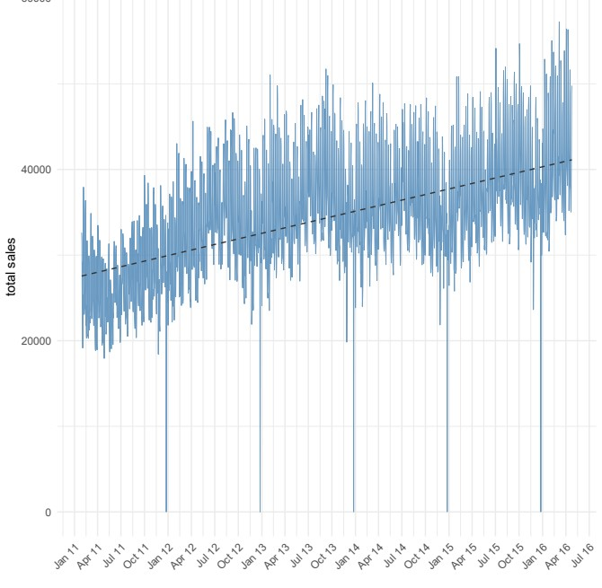

# Kaggle project assignment


#### Gene Eagle, Ted Moore, Shawn Cicoria
> {ge29, tm437, sc2443} @njit.edu

\pagebreak

# Project Report - Team [Godzilla](https://devblogs.microsoft.com/azuregov/3135/)

## Team members

| Member               | email           | Contribution |
|----------------------|-----------------|--------------|
| Gene Eagle           | ge29@njit.edu   | Hyper-parameter tuning, module coding, feature development  |
| Theodore (Ted) Moore | tm437@njit.edu  | Feature creation, model tuning, module coding              |
| Shawn Cicoria        | sc2443@njit.edu | Feature review, module coding, infrastructure setup        |


## Pipeline and Methods

The initial R code was taken from [M5 ForecasteR [0.57330]](https://www.kaggle.com/kailex/m5-forecaster-0-57330/) but modified and improved to the point we were able to beat that notebook's score of `0.57`.

### Dataset size issues
The team at first realized the size of the data was going to be an issue. We first examined the data and basic exploratory data analysis and realized the extend and size of the data would most likely be an issue.

First attempts at running on local machines basic models caused errors with memory consumption.

At first we utilize sampling of the data to limit the the number of training samples for training the model, but that achieve horrible performance.  For example, the following used conditional sampling for our "read data" function that was used both in training and prediction.

### XGBoost
We also utilized the R XGBoost library, which provides highly optimized parallel tree boosting algorithms (GBDT, GBM) and allows extensive configuration (https://xgboost.readthedocs.io/en/latest/parameter.html).

```
create_dt <- function(is_train = TRUE, nrows = Inf, sample_size = 1000) {
  prices <- fread("./data/sell_prices.csv")
  cal <- fread("./data/calendar.csv")
  cal[, `:=`(date = as.IDate(date, format="%Y-%m-%d"),
             is_weekend = as.integer(weekday %chin% c("Saturday", "Sunday")))]

  if (is_train) {
    dt <- fread("./data/sales_train_validation.csv", nrows = nrows)
    dt <- dt[sample(nrow(dt), sample_size), ]
  } else {
    dt <- fread("./data/sales_train_validation.csv", nrows = nrows,
                drop = paste0("d_", 1:(tr_last-max_lags)))
    dt[, paste0("d_", (tr_last+1):(tr_last+2*h)) := NA_real_]
  }
```

Reviewing other examples in Kaggle we ended up taking advantage of the [`data.table`](https://rdatatable.gitlab.io/data.table/) package that provides both fast read capabilities and is memory efficient.  In addition it introduced some operators for the data that helped in providing concise fluent API for querying the data - a "chain like" approach similar to `%>% for other R packages.

The following vignette and article are good overviews:
- https://cran.r-project.org/web/packages/data.table/vignettes/datatable-intro.html
- https://www.machinelearningplus.com/data-manipulation/datatable-in-r-complete-guide/

From the examples the syntax allows complex conditional clauses, SQL like within the statements to make the interaction with the dataset more concise and clearer.


### Dataset for Training
The data provided from Kaggle was essentially "wide" format with a column for every day, and rows representing item sales down to the granular level, but also aggregate records based upon their regional structures.


The data plotted as a time series:




### Dataset features
The dataset acknowledged holidays, but only on the single observed day. It was our hypothesis that sales trends might be affected for a period prior to the individual events, so we engineered a feature that flagged the 7-day-prior period for each holiday. While this reduced MSE, it did not improve accuracy on the unseen data, implying over-fitting. It's possible that by having week numbers (1-52) is enough give that holidays generally occur at the same time each year


#### Features

The goal was to look at the data more on a weekly vs daily period. Summaries and aggregations for periods were added using a span of 1 week to 4 weeks, in addition to supplementing the periods with holiday information.

The columns were stripped down to just the day columns using a filter based upon a regular expression against the column names - specifically `"^d_"` and this was easily accomplished using the features of `data.table.

Event names and weekend binary were added as well for the day.
The primary features supplementing the data was adding a weekend binary indicator of "is weekend" or not.

The remaining feature data, along with per-day sales, were:
```
"item_id", "store_id", "state_id", "dept_id", "cat_id", "event_name_1"
```

Two rolling means were also added - for 7 through 28 days - . These were all look-back periods.

### Review of existing models and choice

The initial set of scripts in R were taken from an existing R notebook for Sales Data. This notebook made use of [LightGBM](https://lightgbm.readthedocs.io/en/latest/) similar to XGboost


### LightGBM
```
LightGBM is a gradient boosting framework that uses tree based learning algorithms. It is designed to be distributed and efficient with the following advantages:
```
- Higher efficiency as well as faster training speed.
- Usage of lower memory.
- Better accuracy.
- Supports Parallel and GPU learning.
- Data of large-scale can be handled


## Acquiring a VERY large VM

At first, memory consumption was an issue. Laptops with 16 Gig or less were not able to handle the entire dataset. Sampling helped, but performance with sampled data wasn't worth it.

Second boundary was CPU. Fortunately, the team has access to Microsoft Azure compute capabilities in for very large Virtual Machines. At one point the team was utilizing a Virtual Machine with 64 cores and 256 Gig of ram. Ultimately, the choice of the underlying package [LightGBM](### LightGBM) the ability to parallel process on many cores permitted a bit better run times.

However, run times were **EXTREMELY LONG** - in some cases 24 hours, and often easily 4 or more hours.

In particular, running DART (http://proceedings.mlr.press/v38/korlakaivinayak15.pdf) proved to be a time consuming process (with the runs consistently being longer than 24 hours). In addition, resource monitoring indicated that the DART algorithm was in fact fully utilizing all of the 64 CPUs allocated on the Azure VM for a large part of the cycle.
Via the LightGBM and XGBoost libraries, we investigated the effects of using the following:

- Regression model – linear, Poisson
- Boosting - Gradient Boosting Decision Tree, DART
- Bagging
- Regularization – LASSO, RIDGE, Elastic Network

And the tuning of the following hyper-parameters:

- Learning rate
- Bin size
- Early stop
- Epochs
- Tree depth
- Bagging ratio


## Training performance

Training the model, since the competition was using `rmse`, that became the tuning parameter in the model.  After about 1900 iterations the model hit best convergence.

```
[LightGBM] [Warning] Unknown parameter: force_row_wise
[LightGBM] [Warning] Met categorical feature which contains sparse values. Consider renumbering to consecutive integers started from zero
[LightGBM] [Warning] Unknown parameter: force_row_wise
[LightGBM] [Info] Total Bins 4575
[LightGBM] [Info] Number of data: 44235060, number of used features: 21
[LightGBM] [Warning] Unknown parameter: force_row_wise
[LightGBM] [Info] Start training from score 0.355880
[1]:	val's rmse:3.43623 
[51]:	val's rmse:2.07949 
[101]:	val's rmse:2.04125 
[151]:	val's rmse:2.0389 

[1851]:	val's rmse:2.00827 
[1901]:	val's rmse:2.00802 
[1951]:	val's rmse:2.0079 
[2001]:	val's rmse:2.00799 
[2051]:	val's rmse:2.00815 
[2101]:	val's rmse:2.00836 
[2151]:	val's rmse:2.00828 
[2201]:	val's rmse:2.00816 
[2251]:	val's rmse:2.00807 
[2301]:	val's rmse:2.00796 
[2351]:	val's rmse:2.00836 
Best score: 2.007784 at 1958 iteration

```

### Best RMSE score:

Our best score `Best score: 2.007784 at 1958 iteration` translated to a score of about `0.51` when submitted to Kaggle (see below).

Training also showed that the rolling averages had the greatest influence on the score.


### Testing 

For Testing, the data set is reset and additionally a forecast by looping through the calendar's first day, through 2 months outwards. The letter `h` below was used to change the horizon in the test runs, with `28` being the final choice - thus `2 * 28 = 56` is the look-ahead period.

Then as each day is predicted using a window of 420 days look-back. The same set of features are created as done to supplement training.

The use of `data.table` again, with it's "fluent" API (chaining statements) that allowed simple multi-conditionals really helped make working with the features and modifications easy.

You can also see that we had a setting for `cores` that was there to enable use of multi-core VM - **64 cores** - and process that much faster. Although for some runs

```

h <- 28 # forecast horizon
max_lags <- 420 # number of observations to shift by
tr_last <- 1913 # last training day

#...

te <- create_dt(FALSE, nrows)

for (day in as.list(seq(fday, length.out = 2*h, by = "day"))){
  cat(as.character(day), " ")
  tst <- te[date >= day - max_lags & date <= day]
  create_fea(tst)
  tst <- data.matrix(tst[date == day][, c("id", "sales", "date") := NULL])
  te[date == day, sales := predict(m_lgb, tst, n_jobs = cores)]
}

```


## Final Testing performance and Public Leader Board Ranking

The plot of the historical and the prediction shown here:


# Kaggle Standing

The submission was automated via script:


**1,339 rank**

The final position in the Kaggle competition at time of this report:

 


### Public Submission Ranking


## Godzilla Virtual Machine


